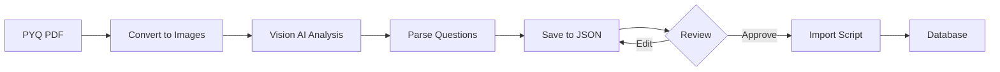

# PYQ Extraction Scripts

Scripts for extracting and importing real CBSE Previous Year Questions into the question bank.

## Overview

1. **`extract-pyq-from-pdf.ts`** - Extracts questions from PYQ PDFs using Vision AI
2. **`import-pyq-json.ts`** - Imports reviewed questions from JSON into database

## Quick Start

### Step 1: Extract Questions from PDF

```bash
npx tsx scripts/extract-pyq-from-pdf.ts <pdf-path> --class=<10|12> --subject=<subject> [--year=2024]
```

**Example**:
```bash
npx tsx scripts/extract-pyq-from-pdf.ts ./pyq-pdfs/math-2024.pdf --class=10 --subject=Mathematics --year=2024
```

**Output**:
- Saves extracted questions to `pyq-extracted/class10-Mathematics-2024.json`
- Shows summary with question counts

### Step 2: Review Extracted Questions

Open the JSON file and verify:
- ✅ All questions extracted
- ✅ Question text is accurate
- ✅ Math formulas use LaTeX ($...$)
- ✅ MCQ options are complete
- ✅ Question types are correct

Edit if needed!

### Step 3: Import to Database

```bash
npx tsx scripts/import-pyq-json.ts pyq-extracted/class10-Mathematics-2024.json
```

Done! Questions are now in the database.

---

## Detailed Usage

### Extract PYQ from PDF

#### Basic Command
```bash
npx tsx scripts/extract-pyq-from-pdf.ts <pdf-path> --class=<10|12> --subject=<subject>
```

#### Options

- `--year=<year>` - Optional year (e.g., 2024)
- `--auto-import` - Automatically import after extraction (skip review step)
- `--dry-run` - Test without saving files

#### Examples

**Class 10 Math (2024)**:
```bash
npx tsx scripts/extract-pyq-from-pdf.ts ./pyq-pdfs/class10/Math-2024.pdf --class=10 --subject=Mathematics --year=2024
```

**Class 12 Physics (no year)**:
```bash
npx tsx scripts/extract-pyq-from-pdf.ts ./physics.pdf --class=12 --subject=Physics
```

**Auto-import (skip review)**:
```bash
npx tsx scripts/extract-pyq-from-pdf.ts ./math.pdf --class=10 --subject=Mathematics --auto-import
```

---

### Import from JSON

#### Basic Command
```bash
npx tsx scripts/import-pyq-json.ts <json-path>
```

#### Options

- `--dry-run` - Test without importing

#### Examples

**Import reviewed questions**:
```bash
npx tsx scripts/import-pyq-json.ts pyq-extracted/class12-Physics-2024.json
```

**Dry run test**:
```bash
npx tsx scripts/import-pyq-json.ts pyq-extracted/class10-Science-2023.json --dry-run
```

---

## How It Works

### Extraction Process



### Vision AI Prompt

The extraction script sends a detailed prompt to Vision AI that:
1. Identifies question numbers
2. Extracts complete question text
3. Preserves LaTeX for math ($x^2$)
4. Detects question types (MCQ/short/long)
5. Extracts marks allocation
6. Captures MCQ options (if applicable)
7. Notes chapters/topics (if visible)

### JSON Output Format

```json
{
  "metadata": {
    "class_level": "10",
    "subject": "Mathematics",
    "year": "2024",
    "extracted_at": "2024-01-15T10:30:00Z",
    "total_questions": 40
  },
  "questions": [
    {
      "question_number": "1",
      "question": "What is $2^3 + 3^2$?",
      "type": "mcq",
      "marks": 1,
      "options": ["11", "12", "13", "17"],
      "correct_index": 3,
      "chapter": "Number Systems"
    },
    {
      "question_number": "15",
      "question": "Prove that $\\sqrt{3}$ is irrational.",
      "type": "long",
      "marks": 5,
      "chapter": "Real Numbers"
    }
  ]
}
```

---

## Where to Get PYQ PDFs

### Official Sources

1. **CBSE Official Website**
   - Sample Papers: https://cbseacademic.nic.in/sample-question-paper.html
   - Question Bank: https://cbseacademic.nic.in/questionbank.html

2. **NCERT**
   - Exemplar Problems: https://ncert.nic.in

### Commercial Sources

- Oswaal Sample Papers
- Arihant PYQ Collections
- Educational publisher websites

---

## Tips for Best Results

### PDF Quality
- ✅ Use high-resolution scans
- ✅ Ensure text is clear and readable
- ✅ Avoid handwritten papers
- ❌ Don't use low-quality photocopies

### Review Checklist
After extraction, verify:
- [ ] All questions captured
- [ ] No duplicate questions
- [ ] Math formulas use LaTeX
- [ ] MCQ options are complete (4 options)
- [ ] Marks are correct
- [ ] Question types match actual types

### Common Fixes

**Missing math symbols**:
```json
// Before
"question": "What is x2 + 2x + 1?"

// After  
"question": "What is $x^2 + 2x + 1$?"
```

**Incomplete MCQ options**:
```json
// Before
"options": ["A", "B", "C"]

// After
"options": ["Option A", "Option B", "Option C", "Option D"]
```

---

## Batch Processing

To extract multiple PDFs:

```bash
# Create a shell script
for pdf in pyq-pdfs/class10/*.pdf; do
  npx tsx scripts/extract-pyq-from-pdf.ts "$pdf" --class=10 --subject=Mathematics
  sleep 5  # Rate limit
done
```

---

## Troubleshooting

**Error: "Cannot find module 'AIService'"**
- Ensure the script is run from project root
- Check that `src/lib/aiService.ts` exists

**Error: "Vision AI timeout"**
- PDFs with 20+ pages may timeout
- Split into smaller PDFs (10-15 pages each)

**Low quality extraction**
- Check PDF resolution (should be at least 300 DPI)
- Ensure good contrast between text and background
- Try different PDF viewer export settings

**Math formulas not working**
- Verify LaTeX syntax: use `$...$` for inline math
- Test in a LaTeX editor first
- Common: `$x^2$`, `$\\frac{a}{b}$`, `$\\sqrt{x}$`

---

## Verification

After import, check in Supabase:

```sql
SELECT 
  class_level,
  subject,
  year,
  COUNT(*) as total,
  COUNT(CASE WHEN qtype = 'mcq' THEN 1 END) as mcqs,
  COUNT(CASE WHEN qtype = 'short' THEN 1 END) as shorts,
  COUNT(CASE WHEN qtype = 'long' THEN 1 END) as longs
FROM question_bank
WHERE year IS NOT NULL
GROUP BY class_level, subject, year
ORDER BY class_level, subject, year DESC;
```

Or test in the CBSE Simulator app.
